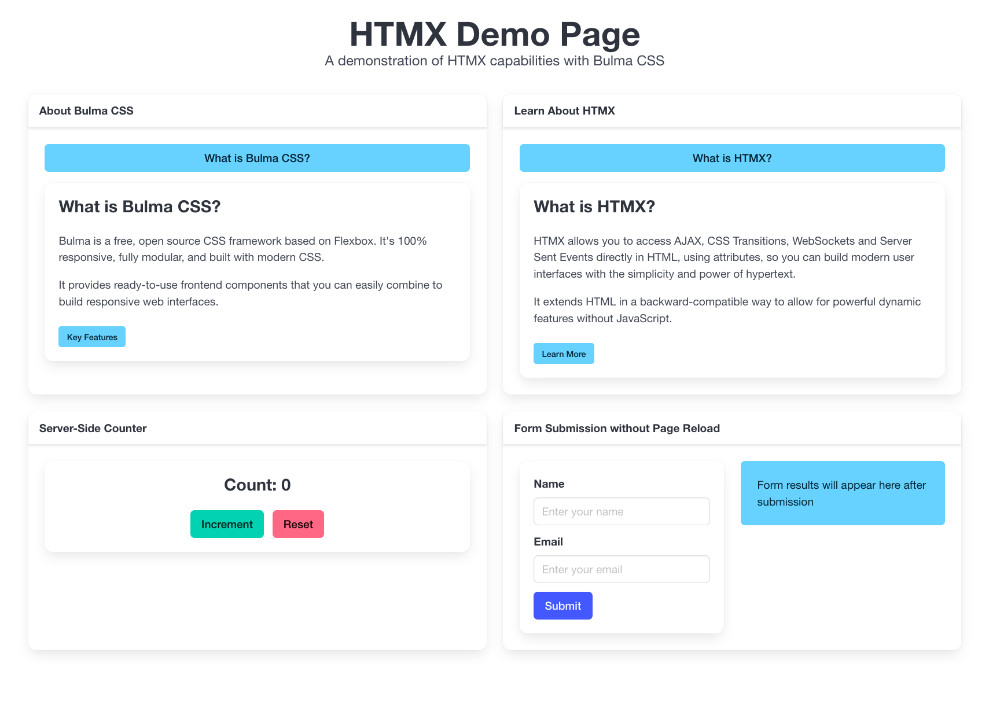

# Go Simple HTMX Demo

TL;DR: A frontend for backend devs, because unfortunately (for whatever reason) a frontend is still actually needed...

A simple showcase of building web apps with HTMX, Go, and Bulma CSS, because who needs the soul-crushing bloat of frontend frameworks? This project smirks at complexity, sticking to the KISS (Keep It Simple, Stupid) mantra while flexing the raw power of server-side sanity.

Go’s template system is so straightforward, it’ll make you wonder why you ever endured JavaScript-induced migraines. Pair it with HTMX’s declarative attributes, and you’re churning out dynamic web apps with less code than a todo list. Templates? Reusable snippets that laugh in the face of frontend chaos. HTMX pings the server, Go renders the HTML, and your page updates smoother than a backend dev’s ego—no JavaScript required, because we’re not masochists.

🔗 [Live Demo](https://go-simple-htmx.mattzab.com)



## 🌟 Features

- **HTMX Integration**: Dynamic content loading without writing JavaScript
- **Go Backend**: Fast, efficient server-side processing
- **Bulma CSS**: Clean, modern styling without JavaScript dependencies
- **Interactive Examples**: Real-world demonstrations of common web patterns
- **Zero JavaScript**: (Almost) No JavaScript required for core functionality

## 🚀 Quick Start

1. Clone the repository:
   ```bash
   git clone https://github.com/mattzab/go-simple-htmx.git
   cd go-simple-htmx
   ```

2. Run the application:
   ```bash
   go run main.go
   ```

3. Open your browser and visit:
   ```
   http://localhost:8080
   ```

## 🛠️ Project Structure

```
go-simple-htmx/
├── main.go           # Go server implementation
├── static/           # Static assets
│   ├── htmx.min.js   # HTMX library
│   └── bulma.min.css # Bulma CSS framework
└── templates/        # HTML templates
    ├── index.html    # Main page template
    └── snippets.html # Reusable HTML snippets
```

## 🔧 How It Works

1. **HTMX**: Handles all dynamic interactions through HTML attributes
2. **Go**: Processes requests and renders HTML templates
3. **Bulma**: Provides beautiful, responsive styling

## 🎯 Key Concepts

### HTMX Attributes
- `hx-get`: Makes GET requests
- `hx-post`: Makes POST requests
- `hx-target`: Specifies where to put the response
- `hx-swap`: Defines how to insert the response
- `hx-trigger`: Specifies when to make the request

### Go Templates
- Uses Go's built-in template system
- Supports template inheritance
- Handles dynamic content rendering

### Bulma CSS
- Mobile-first responsive design
- Modern component library
- No JavaScript dependencies

## 🤝 Contributing

Contributions are welcome! Please feel free to submit a Pull Request.

## 🙏 Acknowledgments

- [HTMX](https://htmx.org/) - For making web development simpler
- [Bulma CSS](https://bulma.io/) - For beautiful, responsive styling
- [Go](https://golang.org/) - For fast, efficient server-side processing

## 📚 Resources

- [HTMX Documentation](https://htmx.org/docs/)
- [Bulma Documentation](https://bulma.io/documentation/)
- [Go Web Development](https://golang.org/doc/articles/wiki/) 
